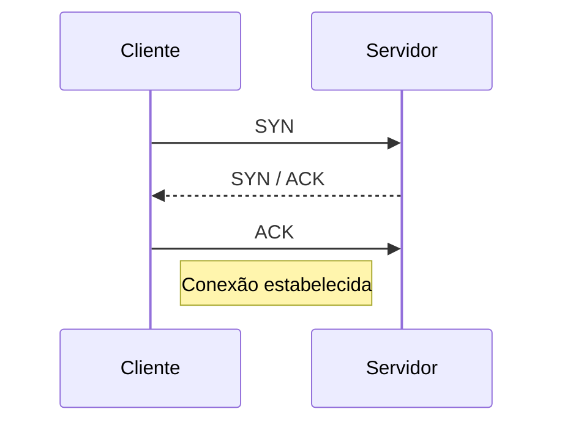

## 1. O que é um Protocolo de Rede

Um protocolo de rede é a “linguagem” que permite a comunicação entre dois ou mais dispositivos. Exemplos:

- **NetBIOS**: pensado em redes pequenas e locais.
    
- **TCP/IP**: protocolo dominante na Internet, com funções de roteamento, alta velocidade e confiabilidade.
    

---

## 2. Endereçamento IP

### 2.1 O que é um IP?

É o “endereço” do seu dispositivo na rede, assim como sua casa precisa de um CEP para receber correspondências.

> **Exemplo simples**  
> Imagine que alguém queira visitar sua casa. Você fornece seu endereço completo (rua, número, cidade). No mundo digital, em vez do nome do logradouro, usamos um IP, como `192.168.0.10`.

### 2.2 IP Privado vs. IP Público

- **Privado** (uso interno): só funciona dentro de uma rede local. Ninguém de fora consegue “bater” diretamente.
    
    - Faixas RFC 1918:
        
        - 10.0.0.0 – 10.255.255.255
            
        - 172.16.0.0 – 172.31.255.255
            
        - 192.168.0.0 – 192.168.255.255
            
    - **Exemplos em casa**:
        
        - Roteador: 192.168.1.1
            
        - Celular: 192.168.1.100
            
        - TV: 192.168.1.101
            
        - Notebook: 192.168.1.102
            
- **Público** (acesso global): acessível de qualquer lugar da Internet.
    
    - **Exemplo real**: `8.8.8.8` (DNS público do Google)
        

---

## 3. Interface de Loopback

- Todo computador tem a interface **loopback**, normalmente `127.0.0.1`.
    
- Serve para testes internos: o próprio dispositivo “fala consigo mesmo”.
    

---

## 4. Portas de Origem e Destino

Além de IP de origem e destino, cada fluxo usa portas para identificar aplicações:

- Porta de origem: define o processo cliente.
    
- Porta de destino: define o serviço no servidor (por exemplo, porta 80 para HTTP, 443 para HTTPS).
    

**Portas comuns**:

- 20/21 – FTP
    
- 22 – SSH
    
- 25 – SMTP
    
- 53 – DNS
    
- 80 – HTTP
    
- 443 – HTTPS
    

---

## 5. Fluxo de Conexão TCP (3-way Handshake)

1. **SYN**: cliente solicita conexão.
    
2. **SYN/ACK**: servidor responde que aceita.
    
3. **ACK**: cliente confirma e inicia troca de dados.
    

---

## 6. Modelos de Referência

### 6.1 Modelo OSI (7 camadas)

1. **Application** (Aplicação) – HTTP, FTP, DNS…
    
2. **Presentation** (Apresentação) – criptografia, compressão…
    
3. **Session** (Sessão) – controle de diálogo entre sistemas.
    
4. **Transport** (Transporte) – TCP, UDP.
    
5. **Network** (Rede) – IP, roteamento.
    
6. **Data-Link** (Enlace) – Ethernet, controle de acesso ao meio.
    
7. **Physical** (Física) – cabos, sinais elétricos/ópticos.
    

### 6.2 Modelo TCP/IP (4 camadas)

1. **Application** – engloba Application, Presentation e Session do OSI. Exemplos: HTTP, DNS, SMTP.
    
2. **Transport** – TCP (confiável) e UDP (não confiável).
    
3. **Internet** – IP, roteamento entre redes.
    
4. **Link (ou Network Interface)** – Ethernet, Wi-Fi, camada física e de enlace.
    

---

## 7. Como o DNS Funciona

O **DNS** (Domain Name System) traduz nomes amigáveis em IPs numéricos, funcionando como uma “agenda telefônica” da Internet:

1. Verifica cache local (no SO).
    
2. Consulta o servidor DNS do provedor.
    
3. Se necessário, sobem à raiz → TLD → servidor autoritativo.
    
4. Retornam o IP para o cliente.
    

> **Exemplo**:  
> Você digita `google.com` → DNS devolve `142.250.190.14`.

---

## 8. ASN e BGP

- **ASN (Autonomous System Number)**: número único que identifica uma grande rede ou conjunto de redes sob uma única política de roteamento.
    
- **BGP (Border Gateway Protocol)**: protocolo de troca de rotas entre ASNs, determinando o melhor caminho para o tráfego entre redes na Internet.
    

---

### Resumo Prático

- **TCP/IP**: modelo de referência da Internet.
    
- **DNS**: converte nomes em IPs.
    
- **Portas**: identificam serviços.
    
- **Loopback**: interface interna (127.0.0.1).
    
- **OSI vs. TCP/IP**: saber onde cada protocolo se encaixa facilita o troubleshooting.
    
- **ASN/BGP**: mantêm a Internet roteável e resiliente.