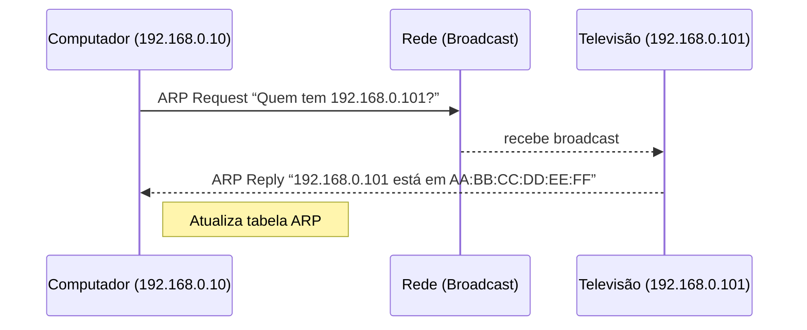

## 1. LAN vs WAN

- **LAN (Local Area Network)**  
    Rede interna, limitada a um prédio, escritório ou residência. Dispositivos conectam-se por cabos Ethernet ou Wi-Fi a um switch ou roteador local.
    
- **WAN (Wide Area Network)**  
    Rede de longa distância, interliga LANs em diferentes locais geográficos via provedores de Internet (ISP), enlaces de fibra, links MPLS etc.
    

```mermaid
flowchart LR
    subgraph LAN [Rede Local (LAN)]
        PC[Computador] --- SW[Switch/Switch Wireless]
        TV --- SW
        R[Seu Roteador/Gateway] --- SW
    end
    subgraph WAN [Rede de Longa Distância (WAN)]
        ISP[Provedor de Internet (ISP)]
    end
    R --> ISP
```

---

## 2. ARP (Address Resolution Protocol)

**Função:** descobrir o **MAC address** de um dispositivo a partir do **IP**, para que quadros Ethernet sejam entregues corretamente na LAN.

1. Quando o host precisa enviar um pacote IP a `192.168.0.101` mas não conhece o MAC correspondente, ele gera um **ARP Request** broadcast:  
    “Quem tem IP 192.168.0.101? Responda para 192.168.0.10.”
    
2. O dispositivo com IP `192.168.0.101` responde com um **ARP Reply** unicast:  
    “Eu sou 192.168.0.101 e meu MAC é AA:BB:CC:DD:EE:FF.”
    
3. O host armazena essa informação em sua **tabela ARP** (cache), evitando repetição de consultas.
    



**Tabela ARP (exemplo)**

|IP|MAC|Interface|
|---|---|---|
|192.168.0.101|AA:BB:CC:DD:EE:FF|eth0|
|192.168.0.102|11:22:33:44:55:66|eth0|

---

## 3. NAT (Network Address Translation)

**Por que existe?**

- Endereços IPv4 privados não são roteáveis na Internet.
    
- O roteador faz “tradução” entre IPs privados e um único (ou poucos) IP público.
    

**Como funciona (PAT/Público-Privado)**

1. Dispositivo interno (`192.168.0.10:50000`) faz uma conexão para `8.8.8.8:53`.
    
2. Roteador substitui origem para seu IP público (`200.1.2.3:61000`) e guarda na **tabela NAT**.
    
3. Quando a resposta chega em `200.1.2.3:61000`, o roteador consulta a tabela e encaminha para `192.168.0.10:50000`.
    

---

## 4. BGP (Border Gateway Protocol) e ASN

- **ASN (Autonomous System Number):** identificador único de um conjunto de redes sob política de roteamento comum.
    
- **BGP:** protocolo que troca anúncios de rotas entre ASNs na Internet, escolhendo o melhor caminho com base em políticas e menor “AS-PATH”.
    

**Fluxo simplificado**

1. Seu provedor (ASN 65000) recebe anúncios de roteadores vizinhos (ex: ASN 64512).
    
2. BGP propaga rotas para prefixos (ex: 200.1.2.0/24).
    
3. Seu roteador de borda aprende qual próximo salto usar para cada prefixo global.
    

---

## 5. Como o computador “sabe” quem é o roteador e a TV?

1. **Configuração de rede**:
    
    - IP do roteador definido como **gateway padrão** via DHCP ou estático.
        
2. **ARP para gateway**:
    
    - Antes de enviar pacotes a destinos externos, o host ARP-pergunta “quem é 192.168.0.1?” e obtém o MAC do roteador.
        
3. **MAC Learning em switches**:
    
    - O switch mapeia portas físicas a MACs conforme recebe quadros, sabendo que a TV está na porta X e o PC na porta Y.
        

---

### Resumo prático

- **ARP** mapeia IP → MAC na LAN.
    
- **Switch** aprende MAC → porta.
    
- **Gateway (roteador)** definido nas configurações leva tráfego fora da LAN e faz **NAT**.
    
- **BGP/ASN** roteiam entre redes globais (WAN).
    

---
## 1. Como minha rede se comunica com a Internet

### 1.1 Estrutura de redes internas

- **Rede dos funcionários**
    
    - Bloco: `192.168.0.0/24`
        
    - Dispositivos: notebooks, PCs, impressoras, smartphones → IPs privados.
        
- **Rede dos servidores**
    
    - Bloco: `10.10.0.0/24`
        
    - Dispositivos: banco de dados, web, intranet → gateway `10.10.0.1`, broadcast `10.10.0.255`.
        

> **Nota:** sem um roteador, essas duas redes não “conversam” entre si.

---

### 1.2 Papel do roteador interno

```
[Notebook: 192.168.0.63]       [DB Server: 10.10.0.60]
           \                         /
            \                       /
       [Roteador Interno com duas interfaces]
         - em 192.168.0.1 (LAN usuários)
         - em 10.10.0.1    (LAN servidores)
```

- O PC envia pacotes para IPs fora de `192.168.0.0/24` e o roteador interno encaminha para a rede `10.10.0.0/24` ou, se não for nenhum dos dois blocos internos, manda ao próximo salto (seu roteador de borda).
    

---

## 2. Como o PC alcança o Google

### 2.1 Tabela de rotas no PC

|Destino|Gateway|Interface|
|---|---|---|
|192.168.0.0/24|–|en0|
|10.10.0.0/24|192.168.0.1|en0|
|0.0.0.0/0|192.168.0.1|en0|

1. PC vê destino `100.100.250.130` (Google) → não é local
    
2. Envia para **192.168.0.1** (seu gateway interno)
    

### 2.2 Tabela de rotas no roteador de casa

|Destino|Gateway|Interface|
|---|---|---|
|192.168.0.0/24|–|LAN|
|10.10.0.0/24|–|LAN|
|0.0.0.0/0|2.2.2.1 (ISP)|WAN|

- Todo tráfego “externo” vai para **2.2.2.1**, o modem/roteador do seu provedor.
    

---

## 3. NAT (Network Address Translation)

Quando o roteador de casa recebe um pacote de `192.168.0.63:porta` para `100.100.250.130:porta`:

1. Substitui a origem para seu IP público, por ex. `2.2.2.5:50000`.
    
2. Guarda na **tabela de NAT** (`2.2.2.5:50000` ↔ `192.168.0.63:porta`).
    
3. Envia para o ISP. Na volta, usa a tabela para entregar ao PC certo.
    

---

## 4. BGP e ASN

- **ASN (Autonomous System Number):**  
    Número que identifica cada rede grande na Internet.
    
    - Ex.: Google → **AS15169**; seu ISP → **AS65000**.
        
- **BGP (Border Gateway Protocol):**  
    Protocolo que troca **anúncios de rotas** entre ASNs, permitindo à sua rede (via ISP) encontrar o caminho até `100.100.250.0/24`.
    

```
[Seu ISP – AS65000]
        ↔(BGP troca rotas)↔
[Google – AS15169]
```

---

## 5. “Redes públicas” de exemplo

- **Rede da Google** (`100.100.250.0/24`):
    
    - YouTube → `100.100.250.150`
        
    - Gmail → `100.100.250.130`
        
- **Rede da Meta** (`200.200.250.0/24`):
    
    - Facebook → `200.200.250.0`
        
    - Instagram → `200.200.250.5`
        
    - Outro site→ `200.200.250.10`
        

---

## 6. Pontos de troca e cabos submarinos

- **PTT (Ponto de Troca de Tráfego):**  
    Local onde ISPs e grandes redes trocam tráfego direto (ex.: IX.br), reduzindo latência e custos.
    
- **Cabos submarinos:**  
    Interligam continentes. Grandes ASNs como Google e Meta têm conexões diretas por fibra submarina.
    
    - Mapas:
        
        - Submarine Cable Map → `submarinecablemap.com`
            
        - Mapa de AS (beta) → `mapadeas.ceptro.br`
            

---

## 7. Resumo do fluxo “PC → Google”

```
PC (192.168.0.63)
    ↓ NAT via 192.168.0.1 → 2.2.2.5
ISP (2.2.2.1 / AS65000) ––BGP––> Google (100.100.250.130 / AS15169)
    ← resposta retorna pelo mesmo caminho ––
PC recebe resposta
```

---
## 4. NAT (Network Address Translation)

### 4.1 O que significa NAT?

**NAT** é a sigla de **Network Address Translation** — Tradução de Endereços de Rede.

### 4.2 Para que serve o NAT?

- Permitir que vários dispositivos com IPs **privados** (“invisíveis” na Internet) compartilhem um único IP **público**.
    
- “Mascarar” as origens dos pacotes, reforçando segurança básica.
    
- Mitigar a **escassez de endereços IPv4**.
    

---

### 4.3 Como o NAT funciona (fluxo de ida)

1. **Origem no PC**
    
    - IP de origem: `192.168.0.63:45623`
        
    - Destino: `100.100.250.130:80` (Google HTTP)
        
2. **No roteador**
    
    - Substitui o par origem pela sua interface pública (`2.2.2.5:54236`)
        
    - Grava na **tabela de tradução**
        
    - Encaminha para o ISP
        
3. **Na Internet**
    
    - Enxergam apenas `2.2.2.5:54236 → 100.100.250.130:80`
        

```
PC (192.168.0.63:45623)
      ↓
[Roteador: NAT]
(2.2.2.5:54236 → 100.100.250.130:80)
      ↓
ISP → Internet → Google (100.100.250.130:80)
```

---

### 4.4 Tabela de tradução NAT (exemplo)

|IP Origem|Porta Origem|IP Destino|Porta Destino|IP Traduzido|Porta Traduzida|
|---|---|---|---|---|---|
|192.168.0.63|45623|100.100.250.130|80|2.2.2.5|54236|

- Quando o roteador recebe a resposta de `100.100.250.130:80 → 2.2.2.5:54236`, ele consulta essa tabela e reverte para `192.168.0.63:45623`.
    

---

### 4.5 Fluxo de volta (resposta)

```
Google (100.100.250.130:80)
      ↓
ISP → [Roteador público 2.2.2.5:54236]
      ↓
[Roteador consulta tabela NAT]
  → reverte para 192.168.0.63:45623
      ↓
PC (192.168.0.63:45623)
```

---

### 4.6 Por que o NAT surgiu?

- **Tudo era público**: originalmente cada host tinha um IP público, exposto na Internet — vulnerável a acessos indesejados.
    
- **Segurança**: NAT adiciona uma barreira, pois endereços privados não são alcançáveis diretamente de fora.
    
- **Exaustão de IPv4**: o crescimento de dispositivos (PCs, smartphones, IoT) esgotou o espaço de endereços públicos disponíveis. NAT permitiu reutilizar blocos privados internamente.
    

---

### 4.7 Resumo

1. **NAT** traduz IPs privados → um IP público.
    
2. Mantém **tabela** para corresponder fluxos de ida e volta.
    
3. **Fluxo de ida**: PC → roteador (tradução) → Internet.
    
4. **Fluxo de volta**: Internet → roteador (destradução) → PC.
    
5. Surgiu para **segurança** e **economia** de endereços IPv4.

---
## Links Úteis

- **O que é BGP** (Cloudflare)  
    [https://www.cloudflare.com/pt-br/learning/security/glossary/what-is-bgp/](https://www.cloudflare.com/pt-br/learning/security/glossary/what-is-bgp/)
    
- **O que é ARP** (Fortinet)  
    [https://www.fortinet.com/br/resources/cyberglossary/what-is-arp](https://www.fortinet.com/br/resources/cyberglossary/what-is-arp)
    
- **Visão geral de NAT** (Juniper)  
    [https://www.juniper.net/documentation/br/pt/software/junos/nat/topics/topic-map/security-nat-overview.html](https://www.juniper.net/documentation/br/pt/software/junos/nat/topics/topic-map/security-nat-overview.html)
    
- **Guia Foca – Guia Prático**  
    [https://www.guiafoca.org/guia](https://www.guiafoca.org/guia)